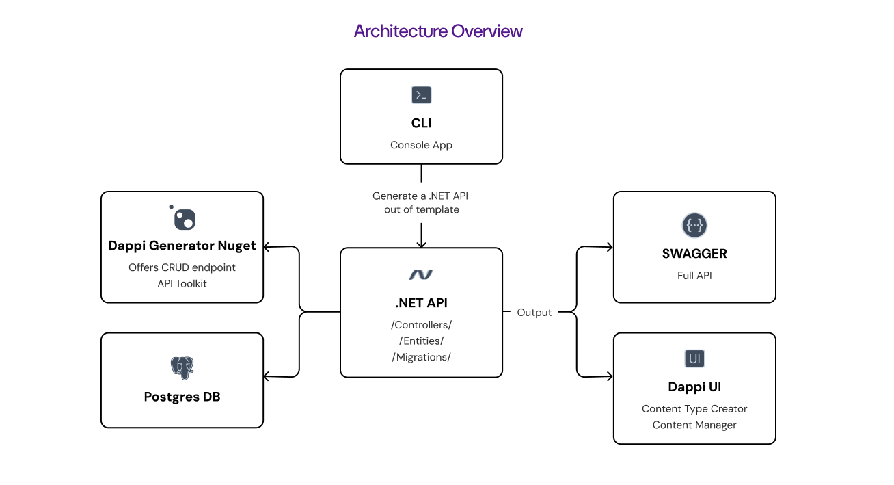

# `Dappi`

_[](https://www.nuget.org/packages/Dappi.SourceGenerator)_ _[](https://www.nuget.org/packages/Dappi.HeadlessCms)_ _[](https://www.nuget.org/packages/Dappi.Cli)_

A powerful .NET tool designed to streamline backend API development by automatically generating controllers with CRUD endpoints for your entities. Build production-ready APIs in minutes, not hours.

## Table of Contents

1. [Features](#features)
2. [Prerequisites](#prerequisites)
3. [Quick Start](#quick-start)
4. [Installation](#installation)
5. [Usage](#usage)
   - [CLI Commands](#cli-commands)
   - [Source Generator](#source-generator)
6. [Examples](#examples)
7. [Configuration](#configuration)
8. [Contributing](#contributing)

## Features

* **Automatic CRUD Generation**: Generate complete controllers with Create, Read, Update, Delete operations
* **Advanced Filtering**: Filter by any field with support for complex queries
* **Built-in Pagination**: Efficient pagination with customizable page sizes
* **Flexible Sorting**: Sort by any field in ascending or descending order
* **Source Generator**: Compile-time code generation for zero runtime overhead
* **CLI Tool**: Scaffold complete projects with a single command
* **Angular UI**: Modern web interface for content management (CCUI.Dappi)
* **Headless CMS**: Ready-to-use content management system
* **PostgreSQL Support**: Optimized for PostgreSQL databases
* **RESTful APIs**: Generate standards-compliant REST endpoints

## Architecture



Dappi consists of three main components working together to provide a complete API development solution:

- **CLI Tool**: Console application for project scaffolding and management
- **Source Generator**: Compile-time code generation for CRUD endpoints
- **Headless CMS**: Content management capabilities with UI components
- **Generated API**: Complete .NET API with controllers, entities, and migrations
- **Angular UI (CCUI.Dappi)**: Modern web interface for content management and API interaction
- **Swagger Integration**: Automatic API documentation
- **PostgreSQL Database**: Optimized data persistence layer

## Prerequisites

* [.NET 9.0](https://dotnet.microsoft.com/en-us/download/dotnet/9.0) or later
* PostgreSQL database (for data persistence)

## Quick Start

Get up and running with Dappi in under 5 minutes:

```bash
# Install the CLI tool
dotnet tool install --global Dappi.Cli --prerelease

# Create a new project
dappi init --name MyApi --path ./MyApi --use-prerelease

# Navigate to your project
cd MyApi

# Configure your database connection in appsettings.json
# Then start your API
dappi start
```

> **Note**: Currently all Dappi packages are in preview. Once stable versions are released, you can omit the `--prerelease` flag.

## Installation

### CLI Tool

```bash
dotnet tool install --global Dappi.Cli --prerelease
```

### Source Generator

Add the source generator to your existing project:

```xml
<PackageReference Include="Dappi.SourceGenerator" Version="*-*">
  <PrivateAssets>all</PrivateAssets>
  <IncludeAssets>runtime; build; native; contentfiles; analyzers</IncludeAssets>
</PackageReference>
```

Or use the CLI:

```bash
dotnet add package Dappi.SourceGenerator --prerelease
```

### Headless CMS

```bash
dotnet add package Dappi.HeadlessCms --prerelease
```

The Headless CMS package provides additional content management capabilities for your Dappi-generated APIs.

> **Note**: All packages are currently in preview. The `--prerelease` flag will be unnecessary once stable versions are available.

## Usage

### CLI Commands

#### Initialize a New Project

```bash
dappi init --name <PROJECT-NAME> --path <OUTPUT-DIRECTORY> --use-prerelease
```

Creates a new Dappi project with all necessary boilerplate code.

#### Start Development Server

```bash
dappi start
```

Starts your API server with hot reload enabled.

### Source Generator

Define your entities using the `[CCController]` attribute to automatically generate CRUD controllers:

```csharp
using Dappi.SourceGenerator;

[CCController]
public class Book
{
    public int Id { get; set; }
    public string Title { get; set; }
    public string Author { get; set; }
    public DateTime PublishedDate { get; set; }
    public decimal Price { get; set; }
}
```

This automatically generates a controller accessible at `/api/book/` with the following endpoints:

- `GET /api/book` - List all books (with filtering, pagination, sorting)
- `GET /api/book/{id}` - Get a specific book
- `POST /api/book` - Create a new book
- `PUT /api/book/{id}` - Update an existing book
- `DELETE /api/book/{id}` - Delete a book

## Examples

### Basic Book API

```csharp
[CCController]
public class Book
{
    public int Id { get; set; }
    public string Title { get; set; }
    public string Author { get; set; }
    public string ISBN { get; set; }
    public DateTime PublishedDate { get; set; }
    public decimal Price { get; set; }
    public bool IsAvailable { get; set; }
}
```

### Advanced Product Catalog

```csharp
[CCController]
public class Product
{
    public int Id { get; set; }
    public string Name { get; set; }
    public string Description { get; set; }
    public string SKU { get; set; }
    public decimal Price { get; set; }
    public int StockQuantity { get; set; }
    public string Category { get; set; }
    public string[] Tags { get; set; }
    public DateTime CreatedAt { get; set; }
    public DateTime UpdatedAt { get; set; }
}
```

### API Usage Examples

```bash
# Get all books with pagination
GET /api/book?page=1&pageSize=10

# Filter books by author
GET /api/book?author=Tolkien

# Sort books by price (descending)
GET /api/book?sortBy=price&sortOrder=desc

# Create a new book
POST /api/book
{
  "title": "The Hobbit",
  "author": "J.R.R. Tolkien",
  "isbn": "978-0547928227",
  "publishedDate": "1937-09-21T00:00:00Z",
  "price": 12.99,
  "isAvailable": true
}
```

## Configuration

### Database Configuration

Configure your PostgreSQL connection in `appsettings.json`:

```json
{
  "Dappi": {
    "PostgresConnection": "Host=localhost;Database=myapi;Username=postgres;Password=password"
  }
}
```

## API Features

### Filtering

Filter by any property of your entity:

```bash
# Single filter
GET /api/book?author=Tolkien

# Multiple filters
GET /api/book?author=Tolkien&isAvailable=true

# Date range filtering
GET /api/book?publishedDate>=2020-01-01&publishedDate<=2023-12-31
```

### Pagination

Efficient pagination with customizable page sizes:

```bash
# Basic pagination
GET /api/book?page=1&pageSize=10

# Large result sets
GET /api/book?page=5&pageSize=50
```

### Sorting

Sort by any field in ascending or descending order:

```bash
# Sort by title (ascending)
GET /api/book?sortBy=title

# Sort by price (descending)
GET /api/book?sortBy=price&sortOrder=desc

# Multiple sort criteria
GET /api/book?sortBy=author,publishedDate&sortOrder=asc,desc
```

### Angular UI

The CCUI.Dappi Angular project provides a modern web interface for managing your Dappi-generated APIs:

- **Content Management**: Intuitive interface for CRUD operations
- **API Explorer**: Interactive tool to test your generated endpoints  
- **Entity Management**: Visual tools for managing your data models
- **Real-time Updates**: Live data synchronization with your API

To work with the Angular UI:

```bash
# Navigate to the Angular project
cd CCUI.Dappi

# Install dependencies
npm install

# Start development server
npm start

# Build for production
npm run build
```

## Contributing

We welcome contributions from the community! Whether you're fixing bugs, improving documentation, or adding new features, we appreciate your help.


## 🛠 Development Setup

Follow these steps to set up the project locally for development.

### 1. Clone the Repository

```bash
git clone https://github.com/codechem/dappi.git
cd dappi
```

### 2. Install Prerequisites

Make sure you have the following installed on your machine:

- [.NET SDK 9.0 or later](https://dotnet.microsoft.com/)
- [PostgreSQL](https://www.postgresql.org/)
  > 💡 Recommended: run PostgreSQL in a Docker container (see step 3)
- [Node.js](https://nodejs.org/) (only required for UI work)  
  > 💡 Recommended Node.js version: 16+

### 3. Set Up PostgreSQL with Docker

To quickly set up a PostgreSQL instance using Docker, run:

```bash
docker run --name DappiPostgres -d \
  -p 5432:5432 \
  -e POSTGRES_PASSWORD=admin \
  -e POSTGRES_USER=postgres \
  postgres:alpine
```

This will:

- Start a PostgreSQL container named `DappiPostgres`
- Expose port 5432
- Set the password for the `postgres` user to `admin`

You can connect to this database using your app or a tool like DBeaver with:

- Host: `localhost`
- Port: `5432`
- User: `postgres`
- Password: `admin`

### 4. Backend Setup

Restore and build the .NET solution:

```bash
cd templates/MyCompany.MyProject.WebApi/
dotnet restore
dotnet build
```

Create migrations and update the database:

```bash
dotnet ef migrations add initial
dotnet ef database update
```

Start the application
```bash
dotnet run
```
### 5. Frontend (UI) Setup *(Optional)*

If you're contributing to the UI part of the project:

```bash
cd CCUI.DAPPI
npm install
npm run start:dev
```
---

## 🙌 Need Help?

If you have questions or need guidance:

- Check the [issues](https://github.com/codechem/dappi/issues)
- Create a new discussion or issue
- Or contact a maintainer

---

Thank you for helping improve DAPPI! 🚀
